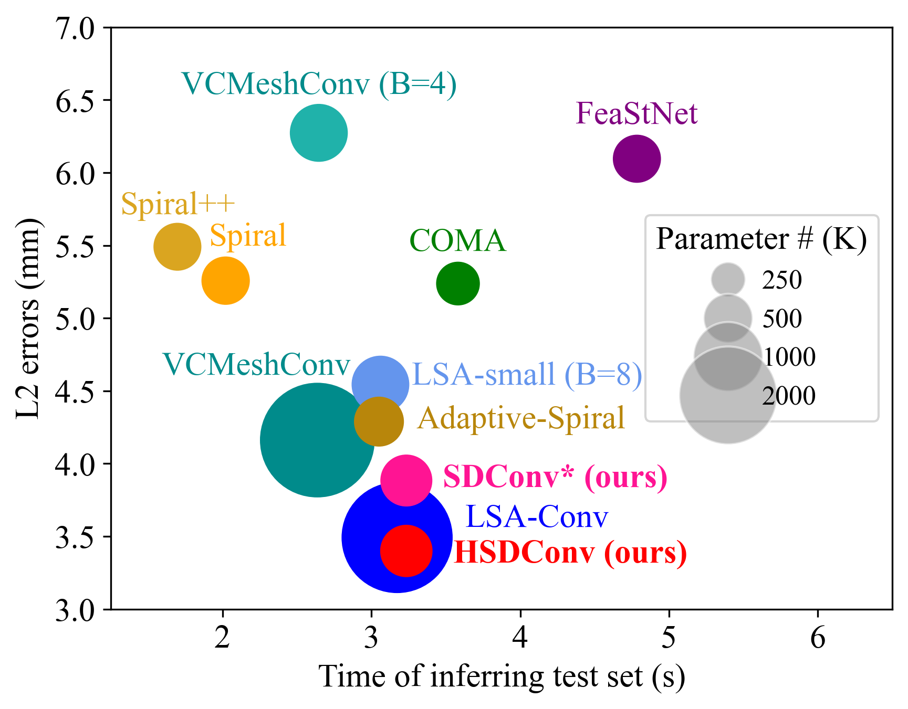

# Hierarchical Mesh Representation Learning with Spectral Dictionary Embedding


This repository is the official implementation of:
- **IJCAI 2021**: "Learning Spectral Dictionary for Local Representation of Mesh"
- **Extension**: "Hierarchical Mesh Representation Learning with Spectral Dictionary Embedding"

## Project Abstract 
Learning mesh representation is important for many 3D tasks. Conventional convolution for regular data (i.e., images) cannot directly be applied to meshes since each vertex's neighbors are unordered. Previous methods use isotropic filters or predefined local coordinate systems or learning weighting matrices for each template vertex to overcome the irregularity. Learning weighting matrices to resample the vertex's neighbors into an implicit canonical order is the most effective way to capture the local structure of each vertex. However, learning weighting matrices for each vertex increases the model size linearly with the vertex number. Thus, large parameters are required for high-resolution 3D shapes, which is not favorable for many applications. 

We learn spectral dictionary (i.e., bases) for the weighting matrices such that the model size is independent of the resolution of 3D shapes. The coefficients of the weighting matrix bases are learned from the spectral features of the template and its hierarchical levels in a weight-sharing manner. Furthermore, we introduce an adaptive sampling method that learns the hierarchical mapping matrices directly to improve the performance without increasing the model size at the inference stage.

## Key Contributions

### IJCAI 2021 - SDConv
- **Spectral Dictionary Convolution (SDConv)**: Uses learnable bases for weighting matrices, making model size independent of mesh resolution
- **Spectral Feature Mapping**: Encodes high-frequency geometric information for better vertex representation
- **Adaptive Temperature Softmax**: Controls the distribution softness for weighting matrix coefficients

### HSDConv Extensions  
- **Adaptive Hierarchical Mapping**: Learns dynamic up/downsampling matrices during training (11.04% improvement on DFAUST)
- **Balanced Spectral Features**: Improved vertex representation combining center vertex and neighbor edge information (3.14% improvement on COMA)  
- **Extended Applications**: Monocular 3D hand reconstruction on FreiHAND dataset
- **Latent Feature Manipulation**: Supports interpolation, mixing, and deformation transfer

Comprehensive experiments demonstrate that our models produce state-of-the-art results with much smaller model size.

**Paper Links:**
- [IJCAI 2021](https://www.ijcai.org/proceedings/2021/95)


# Repository Requirements

This code was written in Pytorch 1.4. We use tensorboardX for the visualisation of the training metrics. We recommend setting up a virtual environment using [Miniconda](https://docs.conda.io/en/latest/miniconda.html). To install Pytorch in a conda environment, simply run 

```
$ conda install pytorch torchvision -c pytorch
```

Then the rest of the requirements can be installed with 

```
$ pip install -r requirements.txt
```


# Data Organization

Here are the pre-processed datasets on Google Drive: [DFAUST-dataset.zip](https://drive.google.com/file/d/14UZq9JkDqjLLBiqHkSoIBZpkW6PQ_Xbi/view?usp=sharing) and [COMA-dataset.zip](https://drive.google.com/file/d/1LNhYee-h5_m1RVzguZvT2oPUsJAK28ac/view?usp=sharing). 

Here are the trained models and logs on Google Drive [DFAUST-Models.zip](https://drive.google.com/file/d/1Eq93ZX0uewJZBHuPdNeFmgCm5dl7WjLm/view?usp=sharing) and [COMA-Models.zip](https://drive.google.com/file/d/185hIebXxBDvDezteXDzXfZCdQRODo_Ck/view?usp=sharing). Please put the models in the folder as the structure below. 

### Preprocessing for your custom dataset:

In order to use a pytorch dataloader for training and testing, we split the data into seperate files by:

```
$ python data_generation.py --root_dir=/path/to/data_root_dir --dataset=DFAUST --num_valid=100
```

The following is the organization of the dataset directories expected by the code:


* data **root_dir**/
  * **dataset** name/ (eg DFAUST-dataset)
    * COMA_downsample
      * downsampling_matrices.pkl (created by the code the first time you run it)
      * pai_matrices.pkl
    * Processed/
      * sliced
        * train.npy (number_meshes, number_vertices, 3) (no Faces because they all share topology)
        * test.npy 
        * points_train/ (created by data_generation.py)
        * points_val/ (created by data_generation.py)
        * points_test/ (created by data_generation.py)
        * paths_train.npy (created by data_generation.py)
        * paths_val.npy (created by data_generation.py)
        * paths_test.npy (created by data_generation.py)
        * mean.tch
        * std.tch
    * results
      * HSDConvFinal-x (hierarchical SDConv result)
        * checkpoints
        * run.log
      * SDConvFinal-x (SDConv result)
        * checkpoints
        * run.log
    * template.obj


## Model Variants

This codebase supports multiple model configurations:

- **SDConv**: Original spectral dictionary convolution (IJCAI 2021)
- **HSDConv**: Hierarchical version with adaptive sampling (Journal extension) 

The model name is automatically generated based on your configuration settings.

## Training and Testing

Configure the main parameters in `pai3DMM.py` (lines 32-36):

```python
root_dir = 'dataset/COMA-dataset'   # 'COMA-dataset', 'DFAUST-dataset', or 'MANO-dataset'
is_hierarchical = True              # True: HSDConv, False: SDConv  
is_same_param = 0                   # 0/1/2: different parameter configurations
is_old_filter = False               # False: updated filter (-x), True: original filter
mode = 'test'                       # 'train' or 'test'
```

Run training or testing:
```bash
python pai3DMM.py
```

### Key Configuration Options:
- `is_hierarchical=True`: Enables adaptive hierarchical mapping matrices (HSDConv)
- `is_old_filter=False`: Uses improved spectral filter (recommended)  
- `base_size`: Controls dictionary size (default 32, affects model size vs accuracy trade-off)

#### Some important notes:
* The code has compatibility with both _mpi-mesh_ and _trimesh_ packages (it can be chosen by setting the _meshpackage_ variable pai3DMM.py).


#### Acknowlegements:

The structure of this codebase is borrowed from [Neural3DMM](https://github.com/gbouritsas/Neural3DMM).

# Citation

Please consider citing our work if you find it useful:

**For the original method (IJCAI 2021):**
```bibtex
@inproceedings{ijcai2021-95,
  title     = {Learning Spectral Dictionary for Local Representation of Mesh},
  author    = {Gao, Zhongpai and Yan, Junchi and Zhai, Guangtao and Yang, Xiaokang},
  booktitle = {Proceedings of the Thirtieth International Joint Conference on
               Artificial Intelligence, {IJCAI-21}},
  publisher = {International Joint Conferences on Artificial Intelligence Organization},
  editor    = {Zhi-Hua Zhou},
  pages     = {685--692},
  year      = {2021},
  month     = {8},
  note      = {Main Track},
  doi       = {10.24963/ijcai.2021/95},
  url       = {https://doi.org/10.24963/ijcai.2021/95},
}
```